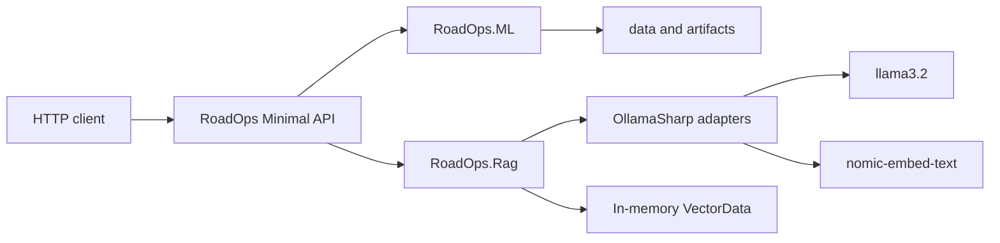
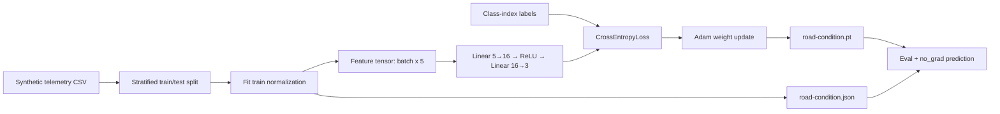
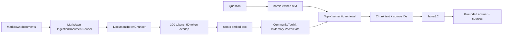

# RoadOps.AI

Small, production-shaped .NET 10 teaching repository for an end-to-end road-operations AI lifecycle. It combines a deterministic TorchSharp classifier for road telemetry with a local, provider-neutral RAG system over operational guidance.

## Architecture



## ML classifier

The classifier predicts `Normal`, `Warning`, or `Critical` from five float features: vehicle speed, ambient temperature, rainfall, road temperature, and vibration. When the CSV does not exist, it creates a deterministic synthetic dataset; training uses a stratified train/test split and fits normalization only on train data.



The network deliberately stays small so the code is inspectable. It uses raw logits with `CrossEntropyLoss`, Adam for optimization, `model.train()` during fitting, and `model.eval()` plus `torch.no_grad()` during evaluation/inference. The train/test result reports accuracy, plus precision, recall, F1, support, and a confusion matrix for each class.

Training changes saved weights; inference loads those weights and the saved normalization profile without changing either. Accuracy is overall correctness. Precision asks whether a predicted class was correct, recall asks whether actual examples of a class were found, and F1 balances both.

## RAG and evaluation

The built-in corpus contains five realistic Markdown documents: winter maintenance, inspections, incident response, fleet procedures, and sensor maintenance. `RagService` depends only on `IChatClient` and `IEmbeddingGenerator<string, Embedding<float>>`; startup chooses OllamaSharp, so another provider can replace it without changing application logic.



Embeddings are numeric representations of meaning, so vector search can retrieve semantically related chunks rather than only exact keyword matches. Chunking is necessary because embedding and LLM context windows are finite: larger chunks retain more context but dilute relevance; overlap protects facts at boundaries while increasing repeated text and storage.

RAG supplies only retrieved context to the answering model. The golden evaluation dataset contains five questions, expected source documents, and reference answers. `/evaluation/run` returns deterministic expected-document retrieval metrics (Hit@K and reciprocal rank) separately from non-deterministic LLM-as-a-judge retrieval, relevance, and groundedness scores. Groundedness asks whether the answer is supported by retrieved context; it is not the same kind of deterministic metric as ML accuracy.

## API

The OpenAPI document is available at `/openapi/v1.json`; runnable examples are in `src/RoadOps.Api/RoadOps.Api.http`.

| Endpoint | Request | Result |
| --- | --- | --- |
| `POST /ml/train` | Empty body | Generates/loads data, trains, persists weights, and returns test metrics. |
| `POST /ml/predict` | Five telemetry values | Returns predicted condition and class probabilities; returns `409` before training. |
| `POST /rag/ingest` | Empty body | Rebuilds the in-memory index from built-in Markdown; returns document/chunk counts. |
| `POST /rag/ask` | `question`, optional `topK` | Returns grounded answer plus scored source chunks; returns `409` before ingestion. |
| `POST /evaluation/run` | Empty body | Runs the five golden questions; requires ingested documents and available Ollama. |

`/rag/ingest`, `/rag/ask`, and `/evaluation/run` return `503` with a local Ollama instruction if the configured provider is unavailable.

### Example prediction

```json
{
  "vehicleSpeed": 55,
  "ambientTemperature": -4,
  "rainfall": 18,
  "roadTemperature": -5,
  "vibration": 6
}
```

## Run

```powershell
ollama pull llama3.2
ollama pull nomic-embed-text
ollama serve
dotnet restore
dotnet build
dotnet test
dotnet run --project src/RoadOps.Api
```

## Production next steps

Replace the in-memory store with durable vector storage, add authentication and authorization, telemetry/observability, evaluation history, source-data security, model and prompt versioning, background ingestion, and scaled model hosting.
