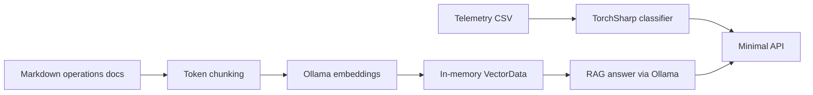

# RoadOps.AI

Small, production-shaped .NET 10 teaching repository for an end-to-end road-operations AI lifecycle.



## Run

```powershell
ollama pull llama3.2
ollama pull nomic-embed-text
ollama serve
dotnet restore
dotnet build
dotnet test
dotnet run --project src/RoadOps.Api
```

Use `src/RoadOps.Api/RoadOps.Api.http`, or call `POST /ml/train`, then `POST /ml/predict`. Call `POST /rag/ingest` before `POST /rag/ask`. The OpenAPI document is served at `/openapi/v1.json`.

## Concepts

Training changes neural-network weights from labelled telemetry; inference loads those saved weights and only produces a class prediction. Accuracy is overall correctness. Precision asks whether a predicted class was correct, recall asks whether actual examples were found, and F1 balances both.

Embeddings are numeric representations of meaning. A vector search finds document chunks whose embeddings are close to a question. Chunking is necessary because LLM context windows and embedding quality are finite: larger chunks retain context but dilute relevance; overlap preserves facts at boundaries while increasing storage and repeated text. This semantic retrieval plus an LLM response grounded in retrieved context is RAG.

Groundedness checks whether a response is supported by its context. Relevance and groundedness are typically LLM-as-a-judge measurements, so they are not deterministic like the ML test-set metrics. `IChatClient` and `IEmbeddingGenerator` keep application logic independent of Ollama; only startup registration chooses OllamaSharp.

## Production next steps

Replace the in-memory store with durable vector storage, add authentication and authorization, telemetry/observability, evaluation history, source-data security, model and prompt versioning, background ingestion, and scaled model hosting.

## Publish to GitHub

After committing locally, authenticate the GitHub CLI and create a repository from this folder:

```powershell
git init
git add .
git commit -m "Initial RoadOps.AI implementation"
gh auth login
gh repo create RoadOps.AI --source=. --push
```

Alternatively, create an empty `RoadOps.AI` repository in GitHub, then run:

```powershell
git remote add origin https://github.com/YOUR-ACCOUNT/RoadOps.AI.git
git branch -M main
git push -u origin main
```
